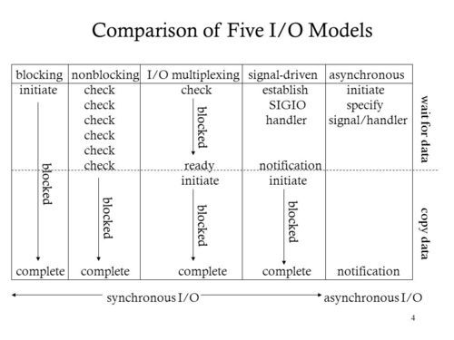

## epoll

### epoll 如何实现百万连接

```c
int epoll_create(int size);//size fd数量,创建了红黑树和就绪链表
int epoll_ctl(int epfd, int op, int fd, struct epoll_event *event);//添加回调函数到红黑树，事件来临时将回调函数写到就绪链表
int epoll_wait(int epfd, struct epoll_event *events,int maxevents, int timeout);//取出就绪链表数据
```

### epoll VS select & poll

- select 轮询实现效率低，有 fd 限制
- poll 去除 fd 限制，实际问题未解决
- epoll 没有采用回调形式，可接入百万 fd

### 问题

为什么使用红黑树

> 新添加 fd 时会查询是否已经存在 fd 的监听事件，如果没有则添加
> 所以插入和删除性能比较好，时间复杂度 log(N)

为什么比较快

> 因为只需要监听就绪链表中是否有数据即可(时间复杂度 O(1))，不需要复制全部的 fd 的用户态

LT 和 ET 区别

> LT：水平触发，效率会低于 ET 触发，尤其在大并发，大流量的情况下。但是 LT 对代码编写要求比较低，不容易出现问题。LT 模式服务编写上的表现是：只要有数据没有被获取，内核就不断通知你，因此不用担心事件丢失的情况。
>
> ET：边缘触发，效率非常高，在并发，大流量的情况下，会比 LT 少很多 epoll 的系统调用，因此效率高。但是对编程要求高，需要细致的处理每个请求，否则容易发生丢失事件的情况。

从本质上讲：与 LT 相比，ET 模型是通过减少系统调用来达到提高并行效率的。

### 网络 IO 模型


