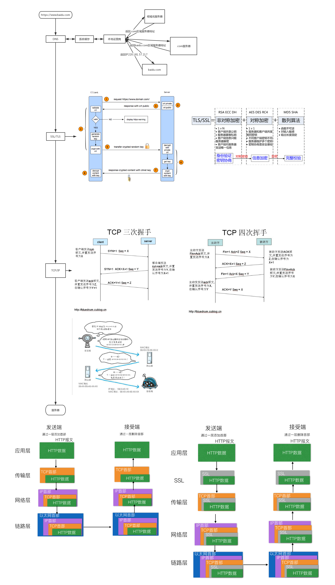

## https 请求过程

### 交互流程

1. 加密通信一条完整的 HTTPS 请求应该是这样的：客户端 (浏览器) 发起 HTTP 请求，请求连接服务端，发送支持的加密通信协议 (和版本)，并且生成一个随机数，后续用于生成"对话密钥"。【关键点：加密协议列表和随机数】

2. 服务端确认加密通信协议 (和版本)，同时也生成一个随机数，后续用于生成"对话密匙"，并且将 CA 颁发的数字证书，一起发送给客户端。【关键点：确认加密协议、随机数、证书】

3. 客户端收到数字证书后，检测内置的"受信任的根证书颁发机构"，查看解开数字证书的公匙是否在。如果解开数字证书的公匙存在，则使用它解开数字证书，得到正确的服务器公匙，同时再次生成一个随机数，用于服务器公匙加密，并发送给服务器。【关键点：解开证书，通过公钥加密随机数】

4. 此时本地和服务器同时将三个随机数，根据约定的加密方法进行加密，各自生成本次会话的所使用的同一把 "会话密匙" 。到这里，认证阶段已经完毕，数据传输从非对称加密换成了对称加密(因为考虑到性能)，接下来所有的数据传输都是使用 HTTP 协议进行传输，只不过使用了 "会话密匙" 来加密内容。【关键点：私钥解密随机数，都使用三个随机数生成密匙】

### 流程图

