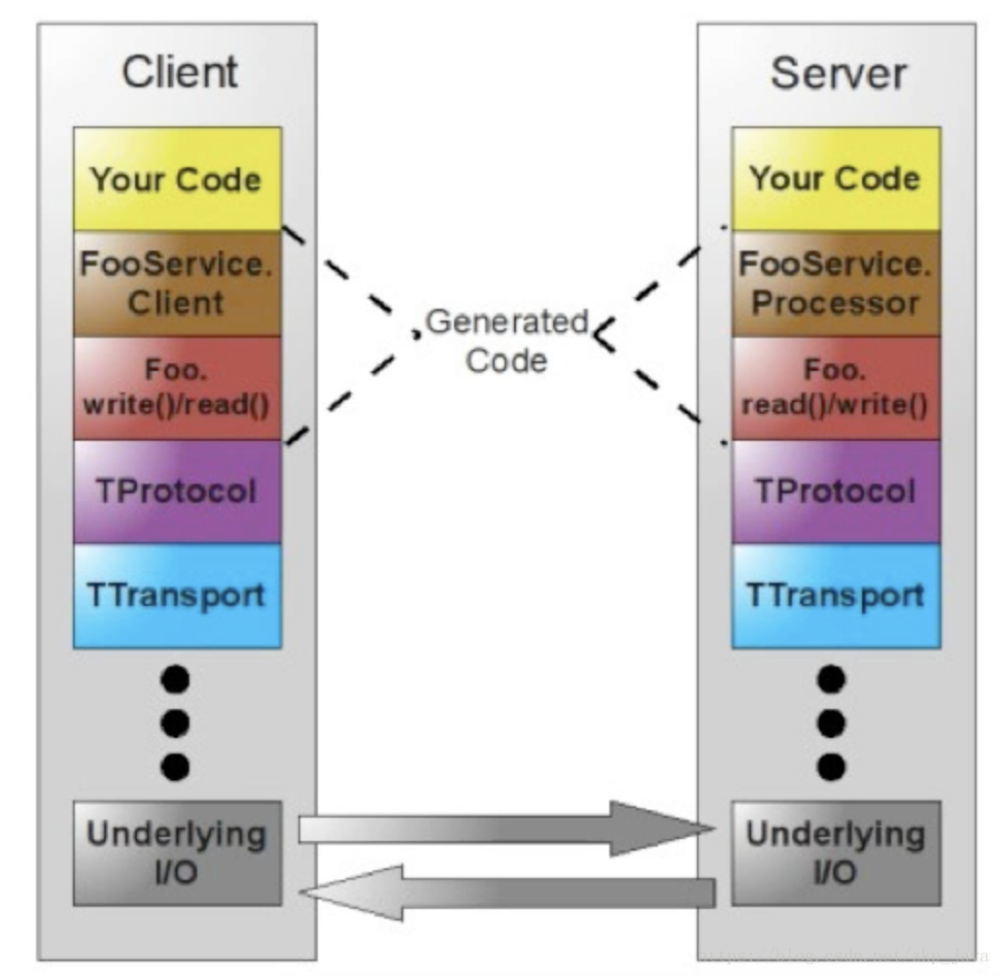

## thrift 笔记

> Thrift 实际上是实现了 C/S 模式，通过代码生成工具将接口定义文件生成服务器端和客户端代码（可以为不同语言），从而实现服务端和客户端跨语言的支持。用户在 Thirft 描述文件中声明自己的服务，这些服务经过编译后会生成相应语言的代码文件，然后用户实现服务（客户端调用服务，服务器端提服务）便可以了。其中 protocol（协议层, 定义数据传输格式，可以为二进制或者 XML 等）和 transport（传输层，定义数据传输方式，可以为 TCP/IP 传输，内存共享或者文件共享等）被用作运行时库。

Thrift 的网络栈如下所示：

### Transport

Transport 层提供了一个简单的网络读写抽象层。这使得 thrift 底层的 transport 从系统其它部分（如：序列化/反序列化）解耦。以下是一些 Transport 接口提供的方法：

除了以上几个接口，Thrift 使用 ServerTransport 接口接受或者创建原始 transport 对象。正如名字暗示的那样，ServerTransport 用在 server 端，为到来的连接创建 Transport 对象。

### Protocol

Protocol 抽象层定义了一种将内存中数据结构映射成可传输格式的机制。换句话说，Protocol 定义了 datatype 怎样使用底层的 Transport 对自己进行编解码。因此，Protocol 的实现要给出编码机制并负责对数据进行序列化。

Protocol 接口的定义如下：

下面是一些对大部分 thrift 支持的语言均可用的 protocol：

(1) binary：简单的二进制编码

(2) Compact：具体见 THRIFT-11

(3) Json

### Processor

Processor 封装了从输入数据流中读数据和向数据数据流中写数据的操作。读写数据流用 Protocol 对象表示。Processor 的结构体非常简单:

与服务相关的 processor 实现由编译器产生。Processor 主要工作流程如下：从连接中读取数据（使用输入 protocol），将处理授权给 handler（由用户实现），最后将结果写到连接上（使用输出 protocol）。

### Server

Server 将以上所有特性集成在一起：

（1） 创建一个 transport 对象

（2） 为 transport 对象创建输入输出 protocol

（3） 基于输入输出 protocol 创建 processor

（4） 等待连接请求并将之交给 processor 处理
