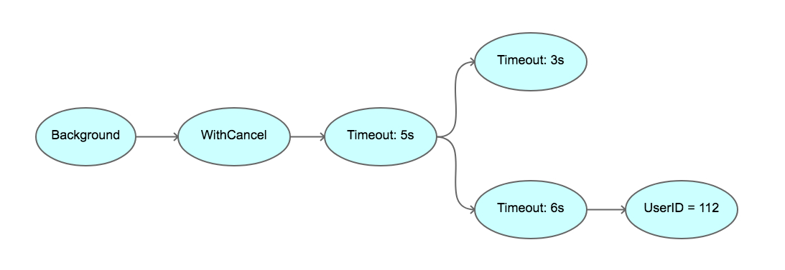
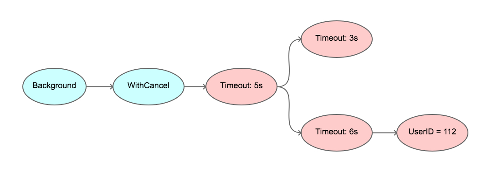

## context 简介

### 并发控制

经典的并发控制方法

#### waitgroup

控制多个 goroutine

```go
func main() {
	var wg sync.WaitGroup

	wg.Add(2)
	go func() {
		time.Sleep(2*time.Second)
		fmt.Println("1号完成")
		wg.Done()
	}()
	go func() {
		time.Sleep(2*time.Second)
		fmt.Println("2号完成")
		wg.Done()
	}()
	wg.Wait()
	fmt.Println("好了，大家都干完了，放工")
}
```

#### chan 通知

全局 chan 控制【全局变量存在并发安全问题】

```go
func main() {
	stop := make(chan bool)

	go func() {
		for {
			select {
			case <-stop:
				fmt.Println("监控退出，停止了...")
				return
			default:
				fmt.Println("goroutine监控中...")
				time.Sleep(2 * time.Second)
			}
		}
	}()

	time.Sleep(10 * time.Second)
	fmt.Println("可以了，通知监控停止")
	stop<- true
	//为了检测监控过是否停止，如果没有监控输出，就表示停止了
	time.Sleep(5 * time.Second)
}

```

#### context

context 树

```go
func main() {
	ctx, cancel := context.WithCancel(context.Background())
	go func(ctx context.Context) {
		for {
			select {
			case <-ctx.Done():
				fmt.Println("监控退出，停止了...")
				return
			default:
				fmt.Println("goroutine监控中...")
				time.Sleep(2 * time.Second)
			}
		}
	}(ctx)

	time.Sleep(10 * time.Second)
	fmt.Println("可以了，通知监控停止")
	cancel()
	//为了检测监控过是否停止，如果没有监控输出，就表示停止了
	time.Sleep(5 * time.Second)

}
```

## context 定义

```go
type Context interface {
	Deadline() (deadline time.Time, ok bool)

	Done() <-chan struct{}

	Err() error

	Value(key interface{}) interface{}
}
```

Deadline 方法是获取设置的截止时间的意思，第一个返回式是截止时间，到了这个时间点，Context 会自动发起取消请求；第二个返回值 ok==false 时表示没有设置截止时间，如果需要取消的话，需要调用取消函数进行取消。

Done 方法返回一个只读的 chan，类型为 struct{}，我们在 goroutine 中，如果该方法返回的 chan 可以读取，则意味着 parent context 已经发起了取消请求，我们通过 Done 方法收到这个信号后，就应该做清理操作，然后退出 goroutine，释放资源。

Err 方法返回取消的错误原因，因为什么 Context 被取消。

Value 方法获取该 Context 上绑定的值，是一个键值对，所以要通过一个 Key 才可以获取对应的值，这个值一般是线程安全的。

常用的方法：Done()、Value()
构建常用子类

```go
func WithCancel(parent Context) (ctx Context, cancel CancelFunc) //手动调用去掉函数
func WithDeadline(parent Context, deadline time.Time) (Context, CancelFunc) //自动超时取消
func WithTimeout(parent Context, timeout time.Duration) (Context, CancelFunc) //自动超时取消
func WithValue(parent Context, key, val interface{}) Context //附带kv context树
```

日常用法：

```go
var key string="name"

func main() {
	ctx, cancel := context.WithCancel(context.Background())
	//附加值
	valueCtx:=context.WithValue(ctx,key,"【监控1】")
	go watch(valueCtx)
	time.Sleep(10 * time.Second)
	fmt.Println("可以了，通知监控停止")
	cancel()
	//为了检测监控过是否停止，如果没有监控输出，就表示停止了
	time.Sleep(5 * time.Second)
}

func watch(ctx context.Context) {
	for {
		select {
		case <-ctx.Done():
			//取出值
			fmt.Println(ctx.Value(key),"监控退出，停止了...")
			return
		default:
			//取出值
			fmt.Println(ctx.Value(key),"goroutine监控中...")
			time.Sleep(2 * time.Second)
		}
	}
}
```

## context 实现细节

- 是不可变的(immutable)树节点
- Cancel 一个节点，会连带 Cancel 其所有子节点 （从上到下）
- Context values 是一个节点
- Value 查找是回溯树的方式 （从下到上）

context 树

```go
package main
func tree() {
  ctx1 := context.Background()
  ctx2, _ := context.WithCancel(ctx1)
  ctx3, _ := context.WithTimeout(ctx2, time.Second * 5)
  ctx4, _ := context.WithTimeout(ctx3, time.Second * 3)
  ctx5, _ := context.WithTimeout(ctx3, time.Second * 6)
  ctx6 := context.WithValue(ctx5, "userID", 12)
}
```



5s 超时之后


什么时候用 context

- 任何函数可能被阻塞，或者需要很长时间来完成的，都应该有个 context.Context

## 常见注意点

何时取消？

```go
ctx, cancel := context.WithTimeout(parentCtx, time.Second * 2)
defer cancel()//立即defer取消
```

为何值不变？

> context.Context 从设计上就是按照 immutable （不可变的）模式设计的
> 同样，Context.Value 也是 immutable 的
> 不要试图在 Context.Value 里存某个可变更的值，然后改变，期望别的 Context 可以看到这个改变
> 更别指望着在 Context.Value 里存可变的值，最后多个 goroutine 并发访问没竞争冒险啥的，因为自始至终，就是按照不可变来设计的
> 比如设置了超时，就别以为可以改变这个设置的超时值

为什么要采用树结构？

> 因为需要：根节点可以控制子节点，子节点不能控制根节点【如果使用一个单独的 context 节点，里面数据变更会影响所有 context 控制的地方。采用树结构只会影响到当前这一块区域】

## 深入了解

- httptrace
- errgroup
