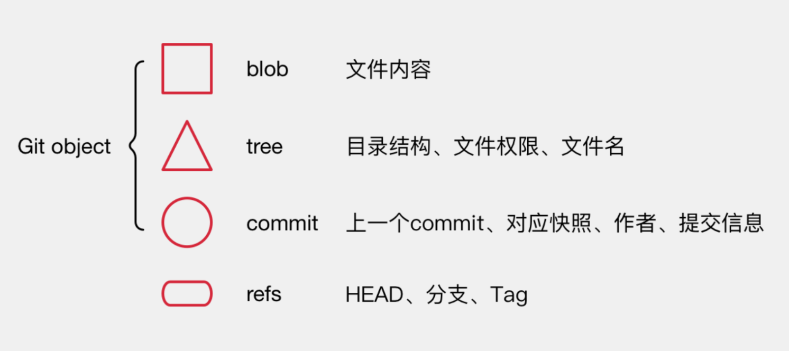

## 常用命令

```bash
git add . //ga
git status //gs
git diff //gd
git commit -m "desc" //gcm
git push //gp
git checkout -b feature/comment //gcb
git pull origin master //gpom
```

## 偶尔用到

```bash
git push --set-upstream origin dev_2
git stash
git log
git cherry-pick xxx
git init
git clone
```

### 很少用到

```bash
git config --global user.name "muName"
git config --global user.email "myEmail"
```

### 其他

#### 比对 diff

```bash
# 显示暂存区和工作区的代码差异
$ git diff

# 显示暂存区和上一个commit的差异
$ git diff --cached [file]

# 显示工作区与当前分支最新commit之间的差异
$ git diff HEAD
git diff HEAD^ 比对当前内容和倒数第二次提交。

# 显示两次提交之间的差异
$ git diff [first-branch]...[second-branch]

```

```bash
# 从暂存区移除一个文件
git rm file
# 从暂存区移除所有文件
git reset .
```

#### rebase

为了提交好看

#### gitnore

```bash
filename  //递归 忽略当前目录下所有包含此文件名的文件
dir/      //递归 忽略目录和子目录
!filename //递归 不忽略文件名

```

## 实现原理


所有的操作都是在操作下面这些元素


流程
git add .

- 把修改文件添加到 Git object 存储
- 把索引指向更新

git commit -m 'update'

- 创建一个新的提交
- 将 HEAD 指向这个新的提交点
